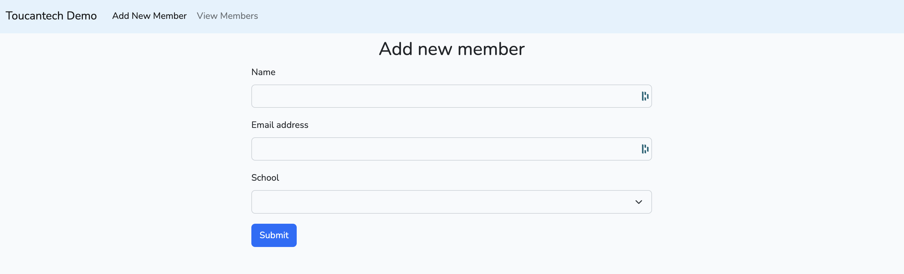
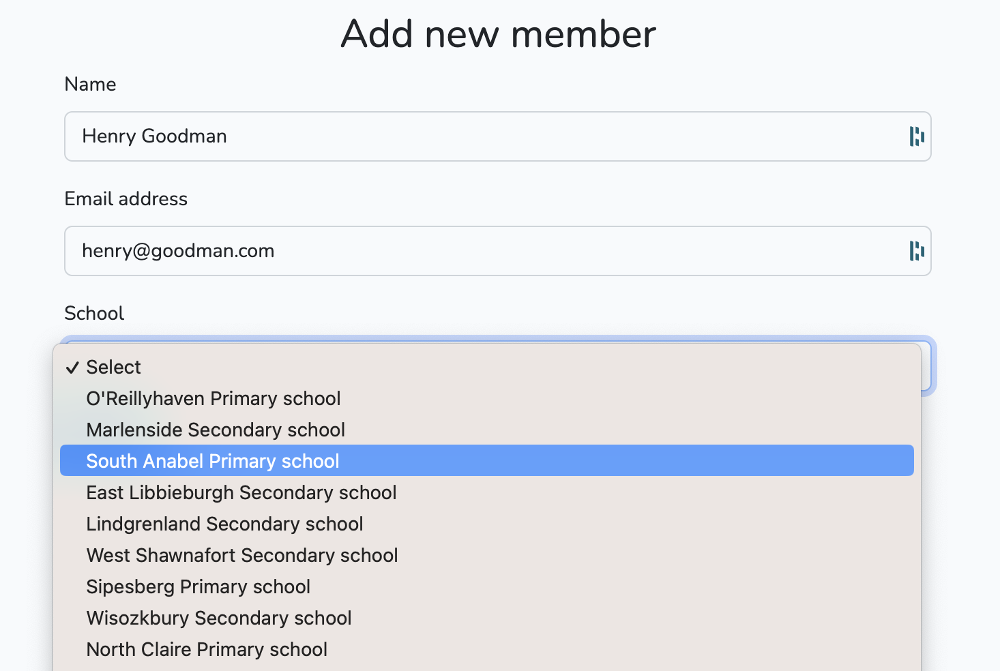
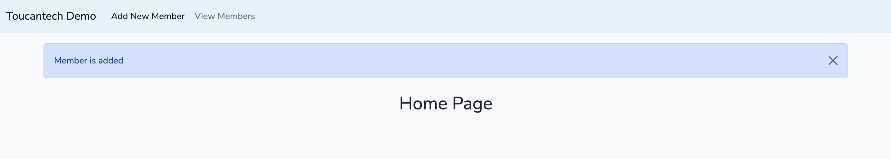
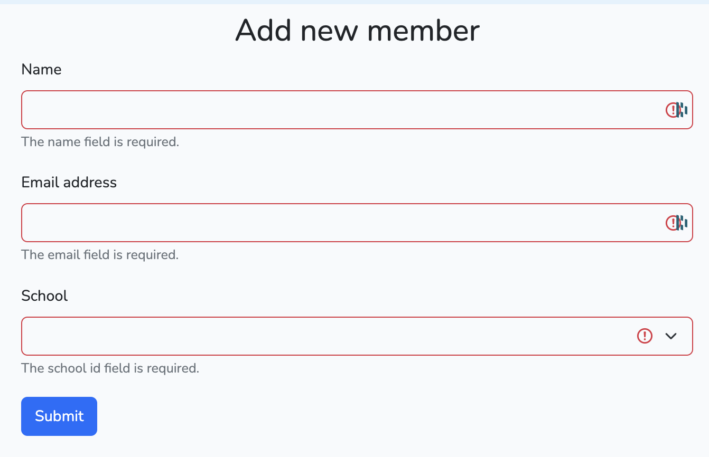
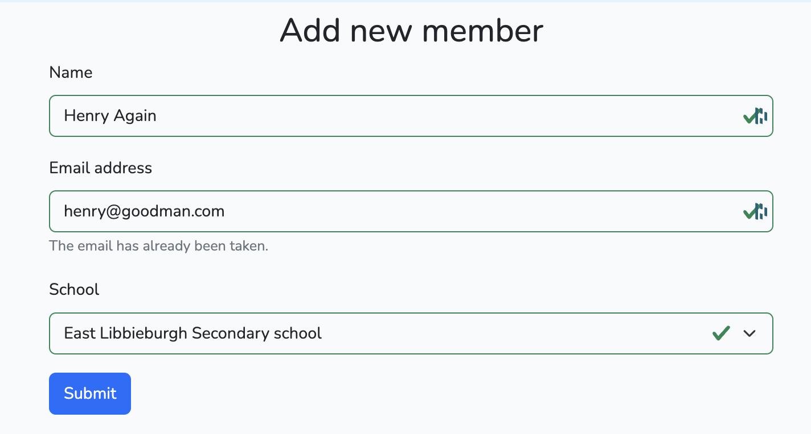
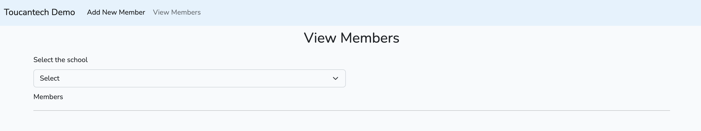
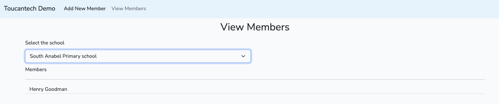

# Toucantech Demo App

This is a simple app to demonstrate how Laravel, Vue.JS, Inertia, Bootstrap, MySQL can be used to add, view data to a web application.

## Build the app


This app requires following softwares installed in your computer.
- [Composer](https://getcomposer.org/download/). Check whether `composer` command is available on your terminal.
```
composer -V
```

- [Docker desktop](https://www.docker.com/products/docker-desktop/)

- Check whether `make` command is available on your terminal. Install it if it is not found.
```
make -v
```
- This app will use the ports 80, 5173, 3306 on your computer, hence they should be available and NOT being used by any of the computer's programs
```
git clone git@github.com:chamithlkml/toucantech-demo.git
cd toucantech-demo
make up
```
This should download the Docker images and build the app from scratch. Once the build process is completed open your browser and navigate to http://localhost to view the app

### Run tests
```
make test
```
This will run the tests and give you the results.

### Stop containers
```
make down
```

## Add New Member
- Click `Add New Member` button


- Enter a Name, Email address and select a school from the dropdown menu.
- The application has 20 dummy schools already seeded on building process


- Click Submit button and the app will add the member and redirect you to the home page with a success message



### Form validation
- Form validation is added in both client-side and server-side. Bootstrap form validation is used for client-side validation.





## View Member
Click `View Members` button



- Select a school from the dropdown menu and it will list members of the school if found.

